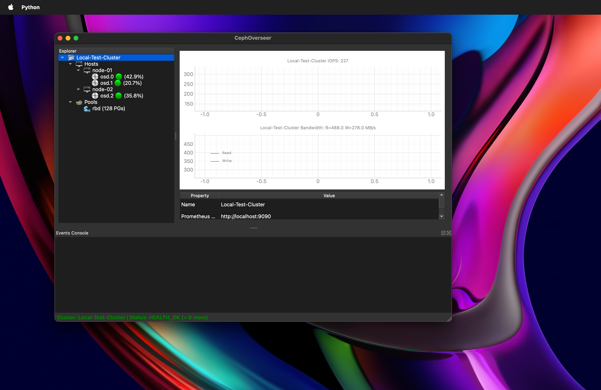

# CephOverseer 🦑


**CephOverseer** is an open-source, native desktop application designed for storage architects and operators to monitor, explore, and visualize multiple Ceph clusters in real-time.

 

Unlike traditional web-based dashboards, CephOverseer provides a snappy, low-latency IDE-style tree explorer and high-performance live graphing. It directly leverages the **Prometheus HTTP API** and the **Ceph MGR REST API** to aggregate and display granular metrics across clusters, hosts, OSDs, and pools without the overhead of a browser.

### Key Features (Planned)
* **Native Desktop Performance:** Built on PyQt5 and PyQtGraph for smooth, non-blocking UI and fast rendering.
* **Multi-Cluster Support:** Manage and monitor disparately located Ceph clusters from a single pane of glass.
* **Deep Explorer View:** Drill down instantly from Clusters ➔ Hosts ➔ OSDs ➔ PGs.
* **Real-Time Telemetry:** Live, rolling graphs of IOPS, bandwidth, and latency using PromQL asynchronous polling.

## Tech Stack
* Python 3.10+
* PyQt5
* PyQtGraph
* httpx (Async HTTP)
* qasync (Asyncio + PyQt5 Event Loop integration)

## Quick Start
```bash
python -m venv venv
source venv/bin/activate
pip install -r requirements.txt
python main.py
```
